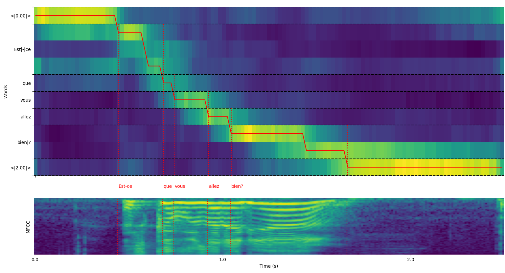

# whisper-timestamped

Multilingual Automatic Speech Recognition with Accurate Word-level Timestamps.

* [Description](#description)
* [Installation](#installation)
* [Usage](#usage)
   * [Python](#python)
   * [Command line](#command-line)
   * [Plotting word alignment](#plotting-word-alignment)
   * [Example output](#example-output)
* [Acknowlegment](#acknowlegment)

## Description
Whisper is a multi-lingual robust speech recognition model, trained by OpenAI,
that achieves state-of-the-art in many languages.
The Whisper models were trained to predict approximative timestamps on speech segments (most of the times with 1 sec accuracy),
but cannot originally predict word timestamps.
This repository proposes an implementation to **predict word timestamps, and give more accurate estimation of speech segments, when transcribing with Whipser models**.

The approach is based on approach dynamic time warping applied to cross-attention weights,
as done by [this notebook by Jong Wook Kim](https://github.com/openai/whisper/blob/f82bc59f5ea234d4b97fb2860842ed38519f7e65/notebooks/Multilingual_ASR.ipynb).
The main addition to this notebook is that **no additional inference steps are required to predict word timestamps**.
Word alignment is done on the fly, after each speech segment is decoded.
In particular, little additional memory is used with respect to the regular use of the model.

Note that another relevant approach to recover word-level timestamps would be to use wav2vec models that predict characters, as implemented in [whisperX](https://github.com/m-bain/whisperX).
But these approaches have several drawbacks, which does not have approachs based on cross-attention weights like `whisper_timestamped`:
* The need to perform twice the inference (once with Whisper, once with wav2vec), which has an impact on the Real Time Factor.
* The need to handle (at least) an additional neural network, which consumes memory.
* The need to find one wav2vec model per language to support.
* The need to normalize characters of whisper transcription in order to match the character set of the wav2vec model.
This often involves awkward language-dependent conversions, like converting numbers to words ("2" -> "two"), symbols to words ("%" -> "percent", "€" -> "euro(s)")... 

## Installation

Requirements:
* `python3` (version higher or equal to 3.7, at least 3.9 is recommended)
* `ffmpeg` (see instructions for installation on the [whisper repository README.md](https://github.com/openai/whisper)

You can install `whisper-timestamped` either by using pip:
```bash
pip3 install git+https://github.com/Jeronymous/whisper-timestamped
```
or by cloning this repository and running installation:
```bash
git clone https://github.com/Jeronymous/whisper-timestamped
cd whisper-timestamped/
python3 setup.py install
```

If you want to plot alignement between audio timestamps and words (as in [this section](#plotting-word-alignment)), you also need matplotlib
```bash
pip3 install matplotlib
```

## Usage

### Python

In python, you can use the function `whisper_timestamped.transcribe()` that is similar to the fonction `whisper.transcribe()`
```python
import whisper_timestamped
help(whisper_timestamped.transcribe)
```
The main differences with `whisper.transcribe()` are:
* The output will include a key `"words"` for all segments, with the word start and end position. Note that word will include punctuation. See example [below](#example-output).
* The options related to beam search and temperature fallback are not available (only "best prediction" decoding is currently supported to get word timestamps).

In general, by importing `whisper_timestamped` instead of `whisper` in your python script, it should do the job
* if you don't use beam search options in transcribe
* if you use `transcribe(model, ...)` instead of `model.transcribe(...)`
```
import whisper_timestamped as whisper

audio = whisper.load_audio("AUDIO.wav")

model = whisper.load_model("tiny", device = "cpu")

result = whisper.transcribe(model, audio, language = "fr")

import json
print(json.dumps(result, indent = 2, ensure_ascii = False))
```

### Command line

You can also use `whisper_timestamped` on the command line, similarly to `whisper`. See help with:
```bash
whisper_timestamped -h
```

The main differences with `whisper` CLI are:
* If an output folder is specified (with option `--output_dir`), then it will save 3 additional files: 2 files `*.words.srt` and `*.words.vtt` with timestamps of words in `SRT` and `VTT` format, and a `json` file which corresponds to the output of `transcribe` (see example [below](#example-output)).
* The options related to beam search and temperature fallback are not available (only "best prediction" decoding is currently supported to get word timestamps).

### Plot of word alignment

Note that you can use option `plot_word_alignment` of python function `whisper_timestamped.transcribe()`, or option `--plot` of `whisper_timestamped` CLI in order to see the word alignment for each segment.
The upper plot represents the transformation of cross-attention weights that is used for Dynamic Time Warping;
The lower plot is a MFCC representation of the input signal (features used by Whisper).



### Example output

Here is an example output of `whisper_timestamped.transcribe()`, that can be seen by using CLI
```bash
whisper_timestamped AUDIO_FILE.wav --model tiny --language fr
```
```json
{
  "text": " Bonjour! Est-ce que vous allez bien?",
  "segments": [
    {
      "id": 0,
      "seek": 0,
      "start": 0.38,
      "end": 1.14,
      "text": " Bonjour!",
      "tokens": [
        25431,
        2298
      ],
      "temperature": 0,
      "avg_logprob": -0.7615641276041667,
      "compression_ratio": 0.8181818181818182,
      "no_speech_prob": 0.07406192272901535,
      "words": [
        {
          "word": "Bonjour!",
          "start": 0.38,
          "end": 1.14
        }
      ]
    },
    {
      "id": 1,
      "seek": 136,
      "start": 1.8,
      "end": 3.02,
      "text": " Est-ce que vous allez bien?",
      "tokens": [
        50364,
        4410,
        12,
        384,
        631,
        2630,
        18146,
        3610,
        2506,
        50464
      ],
      "temperature": 0,
      "avg_logprob": -0.3790776946327903,
      "compression_ratio": 0.7714285714285715,
      "no_speech_prob": 0.09121622145175934,
      "words": [
        {
          "word": "Est-ce",
          "start": 1.8,
          "end": 2.04
        },
        {
          "word": "que",
          "start": 2.04,
          "end": 2.14
        },
        {
          "word": "vous",
          "start": 2.14,
          "end": 2.28
        },
        {
          "word": "allez",
          "start": 2.28,
          "end": 2.4
        },
        {
          "word": "bien?",
          "start": 2.4,
          "end": 3.02
        }
      ]
    }
  ],
  "language": "fr"
}
```

## Acknowlegment
* [whisper](https://github.com/openai/whisper): Whisper speech recognition (License MIT).
* [dtw-python](https://pypi.org/project/dtw-python): Comprehensive implementation of Dynamic Time Warping algorithms (License GPL v3).
